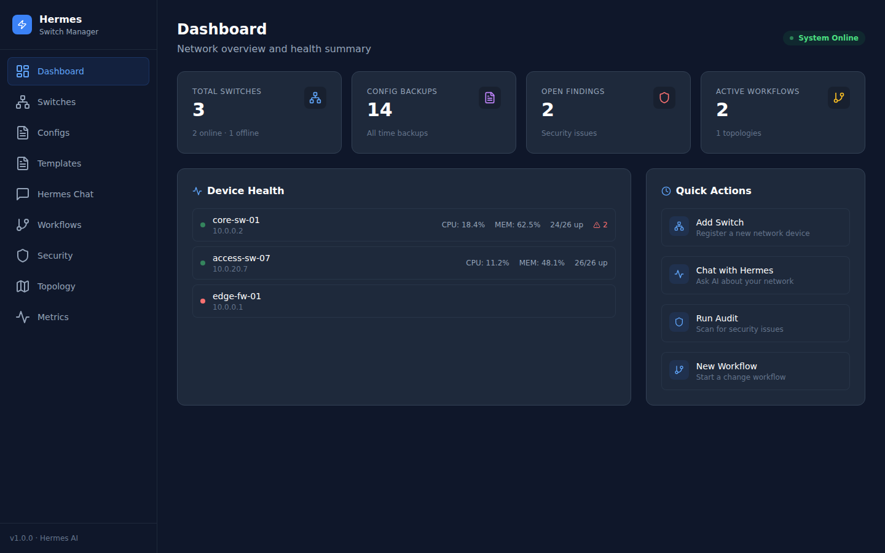

<div align="center">


# nethermind

AI-powered network switch management


</div>

---

<p align="center">
  
</p>

<br>

---

## Features

- **Multi-Vendor Support** — Manage Cisco, HP Aruba, Juniper, Arista, and Linux devices.
- **SSH & Serial** — Connect via Netmiko (SSH) and serial console (COM) connections.
- **45+ Jinja2 Templates** — Built-in configuration templates for common network tasks.
- **IRIS-Style Workflow Engine** — Disciplined configuration change management.
- **Hermes AI Agent** — OpenAI-powered chat assistant for network operations.
- **Security Auditing** — CVE scanning, AAA checks, CIS/NIST compliance auditing.
- **Containerlab Integration** — Auto-discovery and synchronization of lab topologies.
- **Next.js Dashboard** — Modern, responsive web interface.

## Quick Start

```bash
git clone https://github.com/OneByJorah/nethermind.git
cd nethermind

cp .env.example .env  # Configure OpenAI key and database
docker compose up -d
```

Open **http://localhost:3000** in your browser.

### Local Development

```bash
cd backend
pip install -r requirements.txt
uvicorn main:app --reload --port 8000

# Frontend
cd frontend
npm install
npm run dev
```

## Environment Variables

| Variable | Default | Description |
|----------|---------|-------------|
| `DATABASE_URL` | `sqlite:///./switches.db` | Database connection string |
| `OPENAI_API_KEY` | *(empty)* | OpenAI API key for Hermes AI |
| `OPENAI_MODEL` | `gpt-4o` | Model used by the Hermes agent |
| `SSH_USERNAME` | `admin` | Default SSH username for devices |
| `SSH_PASSWORD` | — | Default SSH password (use env in production) |
| `SECRET_KEY` | `change-me` | App secret (change in production) |
| `CORS_ORIGINS` | `http://localhost:3000,http://localhost:5173` | Allowed CORS origins |
| `CLAB_DIR` | `/etc/containerlab/lab` | Containerlab topology directory |

Backend variables live in `backend/.env.example`; the Docker Compose stack reads a root-level `.env` (see `.env.example` at the repo root).

## Architecture

```
Browser (Next.js) ──API──▶ FastAPI Backend ──▶ SQLAlchemy ──▶ SQLite
                                │
                                ├──▶ Netmiko (SSH) ──▶ Network Switches
                                ├──▶ Serial Client ──▶ Console Ports
                                ├──▶ Hermes AI (OpenAI)
                                ├──▶ Jinja2 Templates
                                ├──▶ Workflow Engine
                                └──▶ Security Auditor
```

## Tech Stack

- **Backend**: FastAPI (Python 3.11+), SQLAlchemy, Netmiko
- **Frontend**: Next.js 14 (TypeScript)
- **AI**: OpenAI GPT (Hermes agent)
- **Templates**: Jinja2 (45+ built-in)
- **Database**: SQLite (default), PostgreSQL (production)
- **Deployment**: Docker Compose, Railway

## Supported Vendors

| Vendor | Platforms |
|--------|-----------|
| **Cisco** | IOS, IOS-XE, NX-OS, ASA |
| **HP Aruba** | ArubaOS, Comware |
| **Juniper** | JunOS |
| **Arista** | EOS |
| **Linux** | Ubuntu, CentOS, Debian |

## Project Structure

```
nethermind/
├── backend/
│   ├── main.py              # FastAPI application
│   ├── config.py            # Settings (env-driven)
│   ├── database.py          # SQLAlchemy engine/session
│   ├── schemas.py           # Pydantic request/response models
│   ├── models/              # Database models
│   ├── services/
│   │   ├── netmiko_client.py       # SSH connection management
│   │   ├── serial_client.py        # Serial console connections
│   │   ├── template_engine.py      # Jinja2 rendering + built-in templates
│   │   ├── hermes_agent.py         # AI chat assistant
│   │   ├── workflow_engine.py      # IRIS-style workflows
│   │   ├── containerlab_service.py # Containerlab integration
│   │   └── security_auditor.py     # CVE/compliance scanning
│   └── routers/             # API endpoint modules
├── frontend/
│   ├── src/app/             # Next.js pages
│   └── package.json
├── scripts/                 # CLI tool + start/setup scripts
├── docker-compose.yml       # Docker deployment
└── .env.example             # Compose environment template
```

## API Endpoints

| Endpoint | Method | Description |
|----------|--------|-------------|
| `/api/switches` | GET/POST | Manage network switches |
| `/api/switches/{id}/sync` | POST | Pull live config backup |
| `/api/switches/{id}/health` | POST | Run live health check |
| `/api/switches/{id}/commands` | POST | Execute read-only show commands |
| `/api/configs` | GET | List config backups |
| `/api/configs/diff` | POST | Diff two config backups |
| `/api/templates` | GET/POST | Manage Jinja2 templates |
| `/api/templates/render` | POST | Render a template with variables |
| `/api/chat/stream` | POST | Chat with Hermes AI agent (SSE) |
| `/api/workflows` | GET/POST | Manage configuration workflows |
| `/api/security/audit/{id}` | POST | Run security audit on device |
| `/api/containerlab/scan` | POST | Discover and import lab topologies |

Interactive docs: `http://localhost:8000/docs`.

## Contributing

Contributions are welcome. Please see [CONTRIBUTING.md](CONTRIBUTING.md) for guidelines and [CODE_OF_CONDUCT.md](CODE_OF_CONDUCT.md) for community standards.

## Security

Found a vulnerability? Please follow our [Security Policy](SECURITY.md) and report privately to `security@jorahone.com` — do not use public issues.

## License

[MIT License](LICENSE) © Jhonattan L. Jimenez (OneByJorah)

---

<p align="center">Built with 🌴 by <a href="https://github.com/OneByJorah">OneByJorah</a> · <a href="https://jorahone.com">jorahone.com</a></p>
